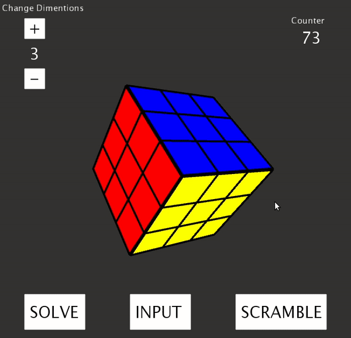

# Rubicks-Cube-Solver 

A cool Rubicks cube Simulation. SCRAMBLE -> SOLVE -> REPEAT

### Android App Demo

&emsp;&emsp;&emsp;
&emsp;&emsp;&emsp;

### Installation

1. clone with all submodules  
`git clone https://github.com/murtaza98/Rubicks-Cube-Solver.git`

2. Download Processing from [here](https://processing.org/download/)

3. For Server Installation,  
  `cd Rubicks-Cube-Solver/App-Server`  
  `chmod a+x install.sh`  
  `chmod a+x run.sh`  
  `./install.sh`

### Usage
1. First start the servers  
`cd Rubicks-Cube-Solver/App-Server`  
`./run.sh`

2. Next start the GUI using Processing, so first start Processing and then click File -> Open, there goto App-Client directory and select Rubicks_Cube_Main.pde in Rubicks_Cube_Main folder

3. Then click on Play button

### Contributers

1. Murtaza Patrawala -- [@murtaza98](https://github.com/murtaza98)

### References

